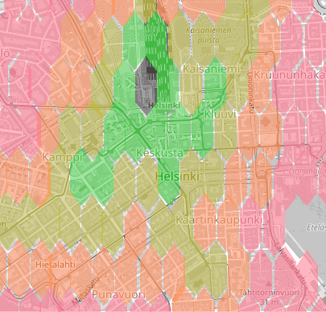
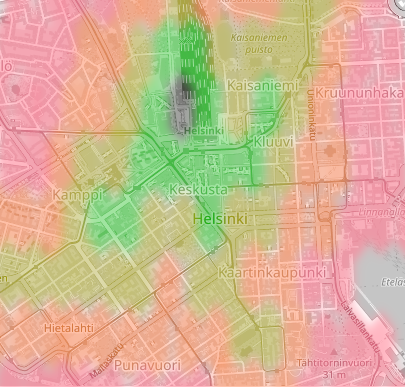

# Estimated HSL time zones

The idea is to create a website that shows time estimates for public transportation in  Helsinki's capital area.

### Simple idea: 

On the website (client), the point that user picks is a starting point and it is sent to the server. Server calculates destination coordinates, communicates with HSL open api, and sends wanted answer back to client. The client draws colored map showing estimated travel times.

Example pictures of outcome: 

### Roadmap:

- ~~Lots of forhead planning~~
- ~~GraphQL query plan~~
- ~~Create website with simple map (leaflet)~~
- ~~First hexagon by click~~
- ~~Implement working WebSocket in server~~
- Getting client and server to communicate via WebSocket
- Implement GraphQL to call HSL open API
- At first create new hexagons in different colors
- Calculate the coordinate of the center points of the hexagons (first six) and return them
- Client draws new hexagons in different color
- Default setting for first reguests: 8 AM in next morning.
- Server sends request of the calculated coordinates to HSL open API
- Modify calculator of coordinates to wait response from HSL open API before starting to calculate new hexagons. (Answer: forward, no answer: stop) Do this x times for now.
- Client draws hexagons in given colour order.
- Planning for colorblind version
- and more...

## Available Scripts

In the project directory, you can run:

### `npm start`

Runs the app in the development mode.\
Open [http://localhost:3000](http://localhost:3000) to view it in the browser.

The page will reload if you make edits.\
You will also see any lint errors in the console.

